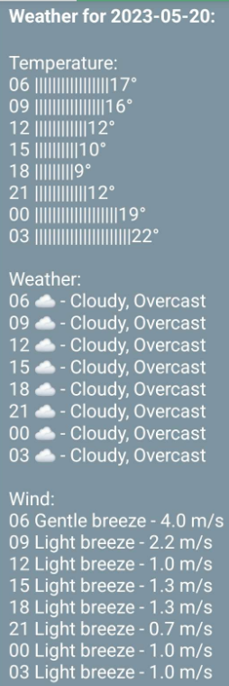

# Weather Notification

This Script uses the openweathermap API to get a forecast. The .json is then broken down into a short weather forecast of the day.
Using Pushbullet it is then send to my phone, as a push notification.
To automate the process, crontab schedules it to run every morning at 5.55am (right before the 6am forecast).

These links offered the grounds for working on this. Most things have been adapted for the intended use:
- pushbullet: https://iotdesignpro.com/projects/home-security-system-using-raspberry-pi-and-pir-sensor-with-push-notification-alert
- API: https://www.geeksforgeeks.org/python-find-current-weather-of-any-city-using-openweathermap-api/

## Version 2
~~I tried to read more than just two pieces of data to get a better overview of how the day's weather would look. To do this, I read more data from the .json and turned it into a graph. This is then sent to my phone with pushbullet.~~ Scrapped because push of pictures didn't work as intended

## Version 3
In this version the data is read and converted into an ASCII-output, thus turning it into a simplified graph. 

